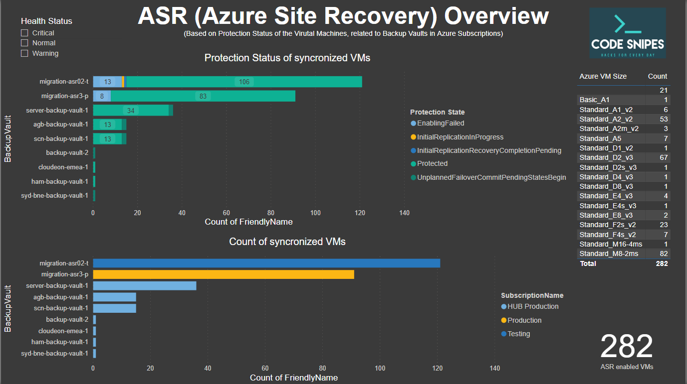

<!--
*** To avoid retyping too much info. Do a search and replace for the following:
*** adminph-de, ps-powerbi-asr-report, N00ky2010, patrick.hayo@flsmidth.com
-->

# Azure Site Recovery (ASR) PowerBI Reporting

[![Contributors][contributors-shield]][contributors-url]
[![Forks][forks-shield]][forks-url]
[![Stargazers][stars-shield]][stars-url]
[![Issues][issues-shield]][issues-url]
[![MIT License][license-shield]][license-url]
[![LinkedIn][linkedin-shield]][linkedin-url]

<br />
<p align="left">
  <a href="https://github.com/adminph-de/ps-powerbi-asr-report">
    
  </a>
  <p align="left">
    Output your ASR status into a PowerBI report by using PowerShell
    <br />
    <a href="https://github.com/adminph-de/ps-powerbi-asr-report/issues">Bug Report</a>
    ·
    <a href="https://github.com/adminph-de/ps-powerbi-asr-report/issues">Request Feature</a>
  </p>
</p>


## Content

- Azuer Site Recovery (ASR) PowerBI Reporting
  - [Documentation](#documentation)
  - [Content](#content)
  - [Prerequisites](#Prerequisites)
  - [Installation](#installation)
  - [Usage](#usage)
  - [Contributing](#contributing)
  - [License](#license)
  - [Contact](#contact)
  - [Acknowledgements](#acknowledgements)
  - [Referenzes](#referenzes)


## Documentation

Find a detaild documentation at [http://github.code-snipes.de/ps-powerbi-asr-report](http://github.code-snipes.de/ps-powerbi-asr-report) 


## Prerequisites

You need an installed [PowerShell](https://docs.microsoft.com/en-us/powershell/) or, if you like to do it on Microsoft Visual Studio Code, you can try the Remote-Connection and let the code run in an isolated Docker container. Find the instruction on how to run here [Using Azure PowerShell in Docker](https://docs.microsoft.com/en-us/powershell/azure/azureps-in-docker?view=azps-4.4.0). It can be helpful if you use a macOS or Linux.

Running the script in the end, you need the Azure "AZ" module installed. Here the simple installation (it works the same way in the Docker container)
[InstallAzure Module "AZ"](https://docs.microsoft.com/en-us/powershell/azure/install-az-ps?view=azps-4.4.0)
```powershell
if ($PSVersionTable.PSEdition -eq 'Desktop' -and (Get-Module -Name AzureRM -ListAvailable)) {
    Write-Warning -Message ('Az module not installed. Having both the AzureRM and ' +
      'Az modules installed at the same time is not supported.')
} else {
    Install-Module -Name Az -AllowClobber -Scope CurrentUser
}
```

[Create an Azure service principal](https://docs.microsoft.com/en-us/powershell/azure/create-azure-service-principal-azureps?view=azps-4.4.0) to run the script with SPN authentification.

Analyzing the generated data, [Microsoft PowerBI](https://powerbi.microsoft.com/en-us/) needs to be available on your computer. You can of cures use an analyzing tool of your choice and connect the generated *.csv file to it. I am not an expert in [Microsoft PowerBI](https://powerbi.microsoft.com/en-us/) and can not guide you to build a report. Find a description of how to import the *.csv file to the example [Microsoft PowerBI](https://powerbi.microsoft.com/en-us/) released in the more detailed documentation.


## Installation

Clone the git reop to start:
```bash
git clone https://git.com/adminph-de/ps-powerbi-asr-report.git
```

## Usage

#### Change the JSON file (report.json)
```json
{
  "delimiter": ";",
  "location":"reports",
  "login": {
      "TENANT_ID": "00000000-0000-0000-0000-00000000000",
      "SPN_ID": "00000000-0000-0000-0000-00000000000",
      "SPN_PW": "yourSpnSecret"
  },
  "subscription": [
      { "name":[ "prod", "test", "dev" ] }
  ]
}
```

#### Execute the script
```bash
report.ps1 -JsonFile report.json
```

#### Script Output in [Microsoft PowerBI](https://powerbi.microsoft.com/en-us/):

<p align="left">
  <a href="https://github.com/adminph-de/ps-powerbi-asr-report">
    
  </a>
</p>

>Find an example PowerBi report  ``/example/report.pbix`` Including a ``report.csv`` example with demo data.

## Contributing

Contributions are what make the open source community such an amazing place to be learn, inspire, and create. Any contributions you make are **greatly appreciated**.

1. [Fork](https://docs.github.com/en/enterprise/2.13/user/articles/fork-a-repo) the Project
2. Create your Feature Branch `git checkout -b feature/AmazingFeature`
3. Commit your Changes `git commit -m 'Add some AmazingFeature'`
4. Push to the Branch `git push origin feature/AmazingFeature`
5. Open a Pull Request


## License

Distributed under the [MIT](https://choosealicense.com/licenses/mit/) License. See `LICENSE` for more information.


## Contact

Project Link: [https://github.com/adminph-de/ps-powerbi-asr-report](https://github.com/adminph-de/ps-powerbi-asr-report)

[Patrick Hayo](patrick.hayo@flsmidth.com)

[](https://www.twitter.com/N00ky2010)


## Acknowledgements

* [Janaina Laguardia Areal Hyldvang, Ph.D.](https://www.linkedin.com/in/janainahyldvang/)
* [Jakob Daugaard](https://www.linkedin.com/in/jakobdaugaard/?locale=en_US)
* [Senthil Kumar Bose](https://www.linkedin.com/in/senthil-kumar-bose-6900582/)
* [Javed Khan](https://www.linkedin.com/in/javed-khan-674863164/)


## Referenzes

* [Create an Azure service principal](https://docs.microsoft.com/en-us/powershell/azure/create-azure-service-principal-azureps?view=azps-4.4.0)
* [Microsoft PowerBI](https://powerbi.microsoft.com/en-us/)


<!-- https://www.markdownguide.org/basic-syntax/#reference-style-links -->
[contributors-shield]: https://img.shields.io/github/contributors/adminph-de/ps-powerbi-asr-report.svg?style=flat-square
[contributors-url]: https://github.com/adminph-de/ps-powerbi-asr-report/graphs/contributors
[forks-shield]: https://img.shields.io/github/forks/adminph-de/ps-powerbi-asr-report.svg?style=flat-square
[forks-url]: https://github.com/adminph-de/ps-powerbi-asr-report/network/members
[stars-shield]: https://img.shields.io/github/stars/adminph-de/ps-powerbi-asr-report.svg?style=flat-square
[stars-url]: https://github.com/adminph-de/ps-powerbi-asr-report/stargazers
[issues-shield]: https://img.shields.io/github/issues/adminph-de/ps-powerbi-asr-report.svg?style=flat-square
[issues-url]: https://github.com/adminph-de/ps-powerbi-asr-report/issues
[license-shield]: https://img.shields.io/github/license/adminph-de/ps-powerbi-asr-report.svg?style=flat-square
[license-url]: https://github.com/adminph-de/ps-powerbi-asr-report/blob/master/LICENSE.txt
[linkedin-shield]: https://img.shields.io/badge/-LinkedIn-black.svg?style=flat-square&logo=linkedin&colorB=555
[linkedin-url]: https://www.linkedin.com/in/patrickhayo/?locale=en_US
[product-screenshot]: images/screenshot.png
[product-documentation]: http://github.code-snipes.de/ps-powerbi-asr-report
