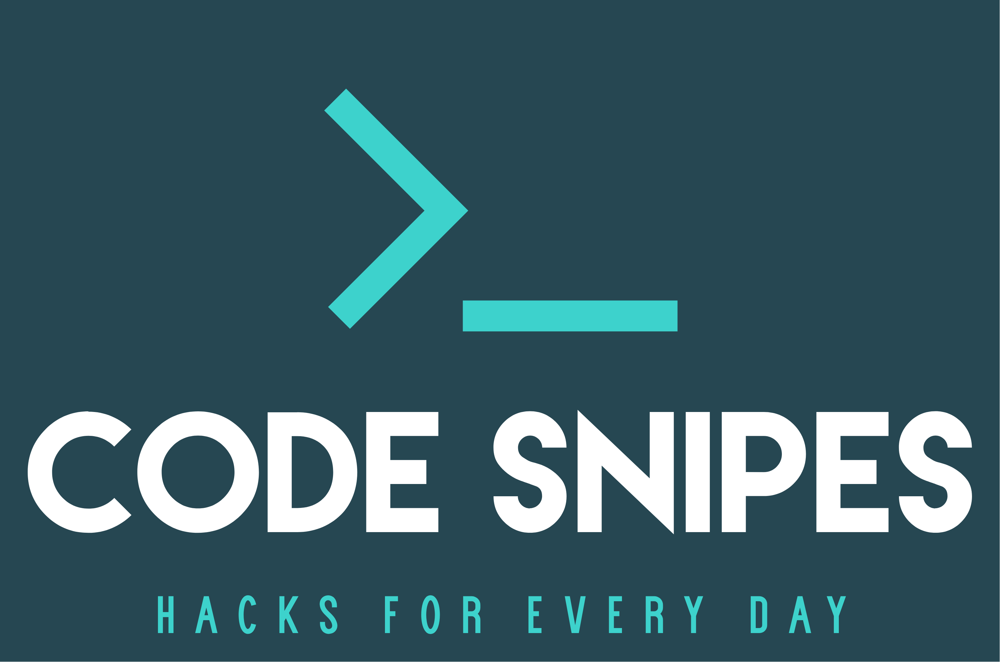

<!--
*** To avoid retyping too much info. Do a search and replace for the following:
*** adminph-de, ps-azure-spn-login, N00ky2010, patrick.hayo@flsmidth.com
-->

# Azuer Service Principal (SPN) Login 

[![Contributors][contributors-shield]][contributors-url]
[![Forks][forks-shield]][forks-url]
[![Stargazers][stars-shield]][stars-url]
[![Issues][issues-shield]][issues-url]
[![MIT License][license-shield]][license-url]
[![LinkedIn][linkedin-shield]][linkedin-url]

<br />
<p align="left">
  <a href="https://github.com/adminph-de/ps-azure-spn-login">
    
  </a>
  <p align="left">
    Use Azure SPN Account to run your PowerShell scripts.
    <br />
    <a href="https://github.com/adminph-de/ps-azure-spn-login/issues">Bug Report</a>
    ·
    <a href="https://github.com/adminph-de/ps-azure-spn-login/issues">Request Feature</a>
  </p>
</p>


## Content

- Azuer Service Principal (SPN) Login
  - [Content](#content)
  - [Installation](#installation)
  - [Usage](#usage)
  - [Contributing](#contributing)
  - [License](#license)
  - [Contact](#contact)
  - [Acknowledgements](#acknowledgements)
  - [Referenzes](#referenzes)


## Installation

Clone the git reop to start:
```bash
https://git.com/adminph-de/ps-azure-spn-login
``` 

## Usage

Change the JSON file (spn-login.json):
```json
[
    {
       "object": {
           "TENANT_ID": "0000000-0000-0000-0000-00000000000",
           "SPN_ID": "0000000-0000-0000-0000-00000000000",
           "SPN_PW": "yourSecretSPNpassword"
     }
    }
]
```

Execute the script:
```bash
spn-login.ps1 -JsonFile spn-account.json
```

Script Output:
```
You are authenicated (SPN) by:
SPN_ID    : 0000000-0000-0000-0000-00000000000
TENANT_ID : 0000000-0000-0000-0000-00000000000
Don't forget to select a Subscrtiption by going ahead
```
>Check my usage of the code-snipe as an example in [ps-powerbi-asr-report](http://github.code-snipes.de/ps-powerbi-asr-report). I used it in the ``report.ps1`` script to authenticate before executing the script.


## Contributing

Contributions are what make the open source community such an amazing place to be learn, inspire, and create. Any contributions you make are **greatly appreciated**.

1. [Fork](https://docs.github.com/en/enterprise/2.13/user/articles/fork-a-repo) the Project
2. Create your Feature Branch `git checkout -b feature/AmazingFeature`
3. Commit your Changes `git commit -m 'Add some AmazingFeature'`
4. Push to the Branch `git push origin feature/AmazingFeature`
5. Open a Pull Request


## License

Distributed under the [MIT](https://choosealicense.com/licenses/mit/) License. See `LICENSE` for more information.


## Contact

Project Link: [https://github.com/adminph-de/ps-azure-spn-login](https://github.com/adminph-de/ps-azure-spn-login)

[Patrick Hayo](patrick.hayo@flsmidth.com)

[](https://www.twitter.com/N00ky2010)


## Acknowledgements

* [Janaina Laguardia Areal Hyldvang, Ph.D.](https://www.linkedin.com/in/janainahyldvang/)
* [Jakob Daugaard](https://www.linkedin.com/in/jakobdaugaard/?locale=en_US)
* [Senthil Kumar Bose](https://www.linkedin.com/in/senthil-kumar-bose-6900582/)
* [Javed Khan](https://www.linkedin.com/in/javed-khan-674863164/)


## Referenzes

* [Create an Azure service principal](https://docs.microsoft.com/en-us/powershell/azure/create-azure-service-principal-azureps?view=azps-4.4.0)


<!-- https://www.markdownguide.org/basic-syntax/#reference-style-links -->
[contributors-shield]: https://img.shields.io/github/contributors/adminph-de/ps-azure-spn-login.svg?style=flat-square
[contributors-url]: https://github.com/adminph-de/ps-azure-spn-login/graphs/contributors
[forks-shield]: https://img.shields.io/github/forks/adminph-de/ps-azure-spn-login.svg?style=flat-square
[forks-url]: https://github.com/adminph-de/ps-azure-spn-login/network/members
[stars-shield]: https://img.shields.io/github/stars/adminph-de/ps-azure-spn-login.svg?style=flat-square
[stars-url]: https://github.com/adminph-de/ps-azure-spn-login/stargazers
[issues-shield]: https://img.shields.io/github/issues/adminph-de/ps-azure-spn-login.svg?style=flat-square
[issues-url]: https://github.com/adminph-de/ps-azure-spn-login/issues
[license-shield]: https://img.shields.io/github/license/adminph-de/ps-azure-spn-login.svg?style=flat-square
[license-url]: https://github.com/adminph-de/ps-azure-spn-login/blob/master/LICENSE.txt
[linkedin-shield]: https://img.shields.io/badge/-LinkedIn-black.svg?style=flat-square&logo=linkedin&colorB=555
[linkedin-url]: https://www.linkedin.com/in/patrickhayo/?locale=en_US
[product-screenshot]: images/screenshot.png
[product-screenshot-run]: images/screenshot_run.png